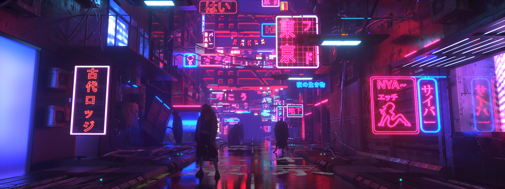

# image-abstraction
Python program that uses an input image to generate an abstract representation.

## Example output
The following is the output of the program with 8 layers of recursion and 
input image quantized into 41 colours. 

The following image was used as input.

## How it works
1. The input image is quantized using OpenCV's kmeans clustering algorithm.
2. The pixel counts of each colour is stored in a python dict.
3. A brute force circle packing algorithm is used to generate circle objects.
4. The circle packing function is recursively called on each child circle until
the desired depth is achieved.
5. All circles are drawn with colour assigned randomly with weights
proportional to the colour distribution in the input image.
